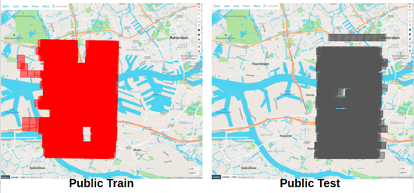
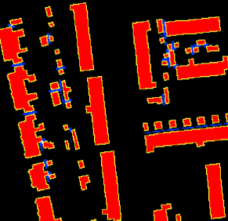
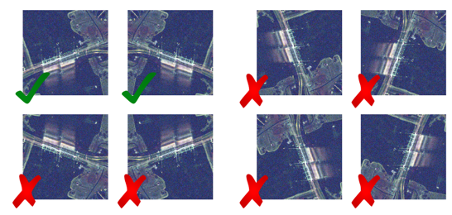
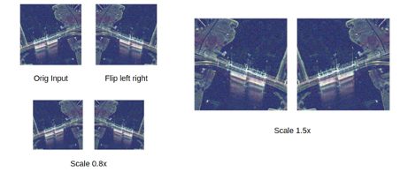

**Marathon Match - Solution Description**

**Overview**

Congrats on winning this marathon match. As part of your final
submission and in order to receive payment for this marathon match,
please complete the following document.

1.  **Introduction**

Tell us a bit about yourself, and why you have decided to participate
in the contest.

-   Name: Zbigniew Wojna

-   Handle: zbigniewwojna

-   Placement you achieved in the MM:

-   About you: Zbigniew Wojna is a deep learning researcher and founder
    of TensorFlight Inc. company providing instant remote property
    inspection based on satellite, aerial and street view imagery,
    primarily for the insurance industry. Zbigniew did his Ph.D. (with
    more than 9000 citations) at the University College London under
    the supervision of Professor Iasonas Kokkinos and professor John
    Shawe-Taylor. His primary interest lies in merging research
    opportunities and business needs for 2D vision applications,
    usually in the large scale settings. Zbigniew in his Ph.D. career
    spent most of the time working across different groups in
    DeepMind, Google Research, and Facebook Research. It includes the
    DeepMind Health Team, Deep Learning Team for Google Maps in
    collaboration with Google Brain, Machine Perception with Kevin
    Murphy, Weak Localization Team with Vittorio Ferrari, and Facebook
    AI Research Lab in Paris. His company TensorFlight Inc. was
    featured as the top 2 AI startups among a few hundred by
    InnovatorsRace50, top 30 out of 2048 teams by IPIEC Global, and
    closed \~\$5M funding from the most prestigious investors in the
    insurance industry.

-   Why you participated in the MM: Due to lockdown I had an opportunity
    to spend much more time on research, I wanted to compare different
    algorithms for building detection on satellite and study the
    previous solutions of SpaceNet and xView competitions.

2.  **Solution Development**

How did you solve the problem? What approaches did you try and what
choices did you make, and why? Also, what alternative approaches did
you consider?

-   I started by merging the baseline model and solution ideas from
    previous competitions. Followed the general semantic segmentation
    setup with unet architecture and postprocessing to extract
    building mask instances. Typically for MSCOCO and Cityscapes the
    best models use directly instance segmentation approaches like
    Mask-RCNN, but for buildings that are quite regular in shapes and
    do not suffer from occlusions, sem segmentation is potentially a
    better-suited approach.

-   Things I have tried that did not help:

    -   **Bigger efficientnet i.e. B6 B7 B8 L2**

    -   ASPP Atrous Spatial Pyramid Pooling / Spatial OCR

    -   1x1 conv bottleneck

    -   Smaller stride (higher resolution of features)

    -   Global context pooling

    -   

    -   **RGBI / Height prediction as auxiliary task**

    -   **Deep watershed and distance transform as auxiliary task**

    -   Auxiliary loss

    -   Scaling focal loss pixel weight wrt building size

    -   

    -   Fixing batch norm params in training

    -   Warm up training

    -   Augmentations: gauss noise, gamma scale, elastic transforms,
        flipping upside down, rotations 90 degrees, channel swapping

3.  **Final Approach**

Please provide a bulleted description of your final approach. What
ideas/decisions/features have been found to be the most important for
your solution performance:

-   The most important was the correct train/val split. Our estimates of
    the tile positions for train and public test dataset is below.

{width="5.744792213473316in"
height="2.6815387139107614in"}

-   You can see the overlap between them, which could cause the
    potential overfitting to the right part of the red area if you
    optimize public test scores. But the more crucial issue was that
    that images are difficult to interpret by the human eye and one
    may miss the fact that on average there are about 20 of them
    covering the same location. Therefore it was important to split
    the dataset by the location, and remove the neighboring
    overlapping tiles from both train and val dataset like on the
    image below. We estimated that there are \~200 unique tiles.

{width="6.270833333333333in"
height="3.9305555555555554in"}

-   I get used to training large datasets taking advantage of 4 cards or
    more in a single training. This dataset is much smaller than it
    may seem initially in terms of covered area, therefore it was more
    than enough to use 1 GPU for training and take advantage of trying
    more ideas and hyperparameters.

-   Deterministic training was crucial to be able to compare results and
    develop ideas that help. As the dataset is relatively small, the
    val estimates were quite noisy and seed could impact a lot the
    metric. Functional.interpolate in pytorch is not deterministic.

-   3 segmentation tasks as binary masks with weighted loss: 1 x
    footprints, 0.25 x edges, 0.1 x contacts, edge width 1, contact
    width 4. Example target mask presented below:

{width="4.046875546806649in"
height="3.9217136920384954in"}

-   Loss function: 1x weighted focal loss + 1x dice loss

-   Weight for positive pixels: 0.5

-   Weight per image: 0.5 + 0.5 \* \#Buildings

-   Finetune EfficientNet B5

-   3 additional signals as extra channels in the middle of the network:

    -   strip one-hot encoding - 204 channels

    -   flight direction - single-channel 0/1

    -   y tile coordinate - single-channel float in the range \[-1, 1\]

{width="6.270833333333333in"
height="2.736111111111111in"}

-   Copy weight for 4th input channel and tried different channel
    ordering

-   Remove the black part of the input image for training, it
    potentially helps with more accurate batch statistics when
    finetuning a pretrained network.

{width="6.270833333333333in"
height="2.736111111111111in"}

-   Left-right flip helps, rotation and upside-down not, due to SAR
    artifacts from the reflection around water

{width="6.270833333333333in"
height="2.986111111111111in"}

-   Inference: 8 models in the ensemble

-   Inference: test time augmentation: left-right flip, 3 scales

{width="6.270833333333333in"
height="2.7083333333333335in"}

-   Mask -\Polygons: I extended the watershed algorithm that I found
    to be very helpful. It was crucial to correctly parametrize the
    postprocessing, for example I removed every prediction below 120
    pixels as they were very noisy, even though the metric required
    each building \80 pixels.

    -   footprint, edge, contact in range \[0,1\] after sigmoid
        transformation

    -   mask = footprint \* (1 - contact)

    -   seed_msk = footprint \* (1 - contact) \* (1 - edge)

    -   seed_msk = remove_small_connected_regions(seed_msk\>0.75)

    -   **mask = watershed(-mask, seed_msk, mask=(mask \0.5))**

4.  **Open Source Resources, Frameworks and Libraries**

Please specify the name of the open source resource along with a URL
to where it's housed and it's license type:

-   II used pretrained models from
    [[https://github.com/rwightman/gen-efficientnet-pytorch]{.ul}](https://github.com/rwightman/gen-efficientnet-pytorch),
    which was approved by organizers

5.  **Potential Algorithm Improvements**

Please specify any potential improvements that can be made to the
algorithm:

-   I still feel like we should be able to leverage somehow RGBI,
    height, and PAN imagery.

-   Compare apples to apples with Mask-RCNN type of architecture

-   Post-processing of polygons to catch false negatives.

6.  **Algorithm Limitations**

Please specify any potential limitations with the algorithm:

-   Currently it does not predict anything below 120 pixels.

-   The model was trained for a specific direction of the radar.

7.  **Deployment Guide**

Please provide the exact steps required to build and deploy the code:

Build and run dockerfile

8.  **Final Verification**

Please provide instructions that explain how to train the algorithm
and have it execute against sample data:

See train.sh, test.sh

