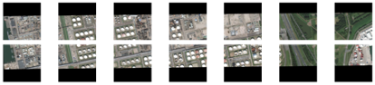

**Spacenet - 6: Multi-Sensor All Weather Mapping**

**Team SatShipAI**

**Overview**

We present a short overview of our solution for the Spacenet-6
competition hosted at Topcoder. In this challenge participants were
asked to extract building footprints using a combination of Synthetic
Aperture Radar (SAR) and traditional electro-optical (EO) imagery
data-sources, over the port of Rotterdam.

1.  **Introduction**

Tell us a bit about yourself, and why you have decided to participate
in the contest.

-   Names: Ioannis Nasios, Konstantinos Vogklis, Christos Iraklis
    Tsatsoulis

-   Handle: SatShipAI

-   Placement you achieved in the MM:

-   About you: Data Science & AI Department, Nodalpoint Systems

-   Why you participated in the MM: Extending our skills & expertise in
    non-maritime satellite data, following our under-development
    product [[SatShipAI]{.ul}](https://satshipai.eu/).

2.  **Solution Development**

How did you solve the problem? What approaches did you try and what
choices did you make, and why? Also, what alternative approaches did
you consider?
>
*Early in the competition we decided to tackle the problem as
pixel-based segmentation instead of instance-based object detection.
Pixels should be organized in detections in a second post-processing
stage. We only used the 4-channel SAR imagery as input. All images
were oriented using SAR_orientations.txt information. We also noticed
that images were grouped in long strips probably as they were taken by
the airborne sensor. These strips were obvious from the filename:*
>
***acquisition started acquisition ended image id (within strip)***
>
*SAR-Intensity_20190823162315_20190823162606_tile_7867.tif*
>
*An integer id in each image name indicates the position of the image
in the final strip. Depending on the orientation of the shot (north to
south or south to north), odd-numbered image ids are adjacent to
even-numbered ones on top-to-bottom. Images having ddd and even
increments by two are always adjacent left-to-right. These relations
are shown below.*
>
*9543, 9545, 9547, 9549, 9551, 9553, 9555,*
>

*9544, 9546, 9548, 9550, 9552, 9554,
9556*
>
*We took advantage of this pattern in two ways: a) we created an
online image generator that combined two adjacent images to produce a
new one. The modes were top-bottom and left-right adjacency. Half of
our models were trained on this enhanced data set. b) we noticed by
our preliminary results on the hold-out set that there was a
correlation between image id and the quality of the image and hence
the segmentation results. We conjectured that the reason was an
increasing or decreasing of the incidence angle as the SAR sensor was
moving from north to south (of in reverse). We decided to adjust the
detection threshold so that it would take image id into account. This
varying threshold was carefully designed using train/validation
splits.*

-   *Prepocessing:*

    -   *Images: Our final models converted 4 channel images SAR into 3
        channel RGB-like, using the formula: RGB = (SAR~1~,
        (SAR~2~+SAR~3~)/2, SAR~4~). Channels 2 and 3 were simply
        averaged to create the middle G channel*

    -   *Scaling: We used min/max scaling using statistics extracted per
        strip (acquisition date). The formula was:*

*def scale_sar_max_dict(data, scale_max, scale_min):*
>
*for i in range(4):*
>
*data\[\..., i\] = (256 \* (data\[\..., i\] - scale_min\[i\])*
>
*/ (scale_max\[i\] - scale_min\[i\]))*
>
*return data*
>
*Scale_max and scale_min were calculate for all images of a specific
strip (eg. 20190823162315_20190823162606)*

-   *Modelling: All our models were pixel-based segmentation models
    implementing the Unet architecture. For diversity, we tried
    several backbones.*

    -   *Model type 1: This type of models have the following
        characteristics*

        -   *Model: Unet with sigmoid output*

        -   *Input Size: (512, 512, 3)*

            -   *Input images were random cropped from originals*

            -   *Input images were constructed by joining to adjacent
                (top/bottom or left/right). The new image was
                constructed using a random percentage from each one of
                the adjacent images*

        -   *Training: Started from 40 iterations on full RGB data and
            then 80 iterations per fold*

        -   *Objective function: Mixed Binary Cross Entropy and Dice*

        -   *Folds 4: We selected a folding scheme that took into
            account image ids for each stip. Each strip was splitted
            separately into 4 parts.*

        -   *Inference: For each image we created an overlapping 3x3
            grid of 512x512 images. This resulted in an overhead of 9
            inferences per image.*

*We used the two backbones below*

-   *se-resnext50_32x4*

-   *Inceptionresnetv2*

*And that led to a total of 8 models.*

-   *Model type 2: This type of models have the following
    characteristics*

    -   *Model: Unet with sigmoid output*

    -   *Input Size: (480x480x3), (736x736x3), (768x768x3), (896x896x3)
        all images resized*

    -   *Objective function: Scaled version of binary cross entropy
        giving more weight to images with higher building count*

    -   *Training: we used a triple scheme on full training data where
        we increase dimensionality. First train on 480x80 then,
        starting from the previous endpoint, train on 768x768 and
        finally ,starting on the previous endpoint, continue train
        setting the network to eval mode. For the case of resnet34 we
        advanced up to 896x896.*

*We used the four backbones below*

-   *se-resnext50_32x4*

-   *resnet34*

-   *EfficientNEt-B4*

-   *DenseNet201*

*And that led to a total of 12 models.*

-   *Postrpocessing: All our models resulted in a pixel map of the
    buildings that needed to be transformed into individual building
    detections. In short, our approach was:.*

    -   *Apply varying threshold values (from 0.45 down to 0.20) to get
        binary masks from continuous predictions.*

    -   *Use scipy.ndimage.label to split the mask into detections and
        label them with increasing ids.*

    -   *Discard detections less than 160 pixels*

    -   *Dilate each detection using cv2.dilate and a small kernel*

    -   *Discard detection with low percentage of high probability
        pixels. We need to keep detections with as many pixels as
        possible above a high threshold.*

3.  **Final Approach**

Please provide a bulleted description of your final approach. What
ideas/decisions/features have been found to be the most important for
your solution performance:
>
*We finally delivered 20 models listed below. 8 of them follow model-1
type of folded inference and 12 of them follow the model-2 type of
increasing dimensionality and setting eval mode. All model outputs
were averaged and produced one final weighted output per image.*
>
effNet4_weightedbce_border/effNet4_weightedbce_border_768_train.pth
>
effNet4_weightedbce_border/effNet4_weightedbce_border_768_eval.pth
>
effNet4_weightedbce_border/effNet4_weightedbce_border_480_train.pth
>
dn201_weightedbce_border/dn201_weightedbce_border_736_train.pth
>
dn201_weightedbce_border/dn201_weightedbce_border_480_train.pth
>
dn201_weightedbce_border/dn201_weightedbce_border_736_eval.pth
>
srxt50_32x4_weightedbce_border/srxt50_32x4_weightedbce_border_768_eval.pth
>
srxt50_32x4_weightedbce_border/srxt50_32x4_weightedbce_border_480_train.pth
>
srxt50_32x4_weightedbce_border/srxt50_32x4_weightedbce_border_768_train.pth
>
rsnt34_weightedbce_border/rsnt34_weightedbce_border_480_train.pth
>
rsnt34_weightedbce_border/rsnt34_weightedbce_border_896_train.pth
>
rsnt34_weightedbce_border/rsnt34_weightedbce_border_896_eval.pth
>
Unet_se_resnext50_32x4d_v1_sar_0/Unet_se_resnext50_32x4d_v1_sar_0.pth
>
Unet_se_resnext50_32x4d_v1_sar_1/Unet_se_resnext50_32x4d_v1_sar_1.pth
>
Unet_se_resnext50_32x4d_v1_sar_2/Unet_se_resnext50_32x4d_v1_sar_2.pth
>
Unet_se_resnext50_32x4d_v1_sar_3/Unet_se_resnext50_32x4d_v1_sar_3.pth
>
Unet_inceptionresnetv2_v1_sar_0/Unet_inceptionresnetv2_v1_sar_0.pth
>
Unet_inceptionresnetv2_v1_sar_1/Unet_inceptionresnetv2_v1_sar_1.pth
>
Unet_inceptionresnetv2_v1_sar_2/Unet_inceptionresnetv2_v1_sar_2.pth
>
Unet_inceptionresnetv2_v1_sar_3/Unet_inceptionresnetv2_v1_sar_3.pth
>
Unet_inceptionresnetv2_v1_rgb_full/Unet_inceptionresnetv2_v1_rgb_full.pth
>
Unet_se_resnext50_32x4d_v1_rgb_full/Unet_se_resnext50_32x4d_v1_rgb_full.pth

*What worked:*

1.  *Online creation of new images using adjacency information. We
    estimated that we created around 30% new images this way.*

2.  *Postprocessing using varying thresholds dependent on image id. The
    bigger the image id the more difficult the detection so the
    threshold should be relaxed accordingly.*

3.  *The Weighted Binary Cross Entropy function used on model-2 type.
    This decision increased focus on areas with many buildings and
    helped the post-processing separation*

4.  *Diversity of approaches. We deliberately kept two separate
    pipelines to attain full diversity*

5.  *Continuing training on eval mode worked unexpectedly well, probably
    by providing diversity to the mixture. When a Pytorch network is
    set in eval mode all normalization and dropout layers are frozen.*

4.  **Open Source Resources, Frameworks and Libraries**

Please specify the name of the open source resource along with a URL
to where it's housed and it's license type:

-   pytorch,
    [[https://github.com/pytorch/pytorch/]{.ul}](https://github.com/pytorch/pytorch/)
    and
    [[https://github.com/pytorch/pytorch/blob/master/LICENSE]{.ul}](https://github.com/pytorch/pytorch/blob/master/LICENSE)

-   torchvision,
    [[https://github.com/pytorch/pytorch/]{.ul}](https://github.com/pytorch/pytorch/)
    and
    [[https://github.com/pytorch/pytorch/blob/master/LICENSE]{.ul}](https://github.com/pytorch/pytorch/blob/master/LICENSE)

-   Shapely,
    [[https://shapely.readthedocs.io/en/latest/manual.html]{.ul}](https://shapely.readthedocs.io/en/latest/manual.html)
    and Creative Commons Attribution 3.0 United States License.

-   scikit-learn,
    [[https://scikit-learn.org/stable/]{.ul}](https://scikit-learn.org/stable/)
    and New BSD License

-   Segmentation_models_pytorch,
    [[https://github.com/qubvel/segmentation_models.pytorch]{.ul}](https://github.com/qubvel/segmentation_models.pytorch)
    and MIT License

-   pytorch_toolbelt,
    [[https://github.com/BloodAxe/pytorch-toolbelt]{.ul}](https://github.com/BloodAxe/pytorch-toolbelt),
    and MIT License

-   albumentations,
    [[https://github.com/albumentations-team/albumentations]{.ul}](https://github.com/albumentations-team/albumentations)
    and MIT License

-   opencv_python,
    [[https://pypi.org/project/opencv-python/]{.ul}](https://pypi.org/project/opencv-python/)
    and MIT License

-   geopandas,
    [[https://github.com/geopandas/geopandas]{.ul}](https://github.com/geopandas/geopandas)
    and BSD 3-Clause \"New\" or \"Revised\" License

-   pretrained_models,
    [[https://github.com/Cadene/pretrained-models.pytorch]{.ul}](https://github.com/Cadene/pretrained-models.pytorch)
    and BSD 3-Clause \"New\" or \"Revised\" License

-   matplotlib,
    [[https://matplotlib.org/]{.ul}](https://matplotlib.org/) and
    Python Software Foundation (PSF) license

-   scikit-image,
    [[https://scikit-image.org/]{.ul}](https://scikit-image.org/) and
    BSD Licence

-   networkx,
    [[https://networkx.github.io/]{.ul}](https://networkx.github.io/)
    and new BSD Licence

-   fiona,
    [[https://pypi.org/project/Fiona/]{.ul}](https://pypi.org/project/Fiona/)
    and BSD Licence

-   Rtree,
    [[https://pypi.org/project/Rtree/]{.ul}](https://pypi.org/project/Rtree/)
    and MIT Licence

-   rasterio,
    [[https://rasterio.readthedocs.io/en/latest/]{.ul}](https://rasterio.readthedocs.io/en/latest/)
    and
    [[https://github.com/mapbox/rasterio/blob/master/LICENSE.txt]{.ul}](https://github.com/mapbox/rasterio/blob/master/LICENSE.txt)

-   Pillow,
    [[https://github.com/python-pillow/Pillow]{.ul}](https://github.com/python-pillow/Pillow)
    and
    [[https://github.com/python-pillow/Pillow/blob/4f6145655b6fa35ec8dd3600041418087e399758/LICENSE]{.ul}](https://github.com/python-pillow/Pillow/blob/4f6145655b6fa35ec8dd3600041418087e399758/LICENSE)

5.  **Potential Algorithm Improvements**

Please specify any potential improvements that can be made to the
algorithm:

-   *Training to full size images 896x896 would be an obvious
    improvement*

-   *Add an instance segmentation solution as well (eg. MaskRCNN /
    Detectron)*

-   *Take advantage of panchromatic and/or IR channels imagery. We could
    design and train an autoencoder model that would map SAR imagery
    to panchromatic/IR, thus helping clearing out SAR images. We did
    devote a limited time trying a similar approach with a Generative
    Adversarial Network (GAN) model, but at this stage at least we
    were not able to get useful results.*

6.  **Algorithm Limitations**

Please specify any potential limitations with the algorithm:

-   *One of the drawbacks of our methodology might be the lack of pure
    instance segmentation algorithms (eg. MaskRCNN). A possible
    synergy between pixel and instance segmentation approaches might
    lead to even better results.*

-   *In general our pipeline was RGB-centric. We turned everything into
    3 channels \[0, 255\] We didn\'t use any other data source except
    4 channel SAR.*

7.  **Deployment Guide**

Please provide the exact steps required to build and deploy the code:
>
*Deployment was based on the template of "data" plus "code" Topcoder
Marathon Matches. We were supposed to prepare a dockerized version of
both training and inference pipelines. More specifically the following
structure was submitted:*
>
*/solution*
>
*solution.csv*
>
*/code*
>
*Dockerfile*
>
*flags.txt*
>
*train.sh*
>
*test.sh\
\...*

*The /code folder of your submission contained :*

-   *All our code (training and inference) that are needed to reproduce
    your results.*

-   *A dockerfile (named Dockerfile, without extension) that was to be
    used to build the dockerised system*

-   *All data files that are needed during training and inference, with
    the exception of*

*the contest\'s own training and test data.*

-   *trained model file(s) (in total 20 models)*

*A docker image was created using the command:*
>
*docker build -t \<id\.*
>
*Were id was assigned by the competition as an identifier of our team
SatShipAI. Then the image was run using the command:*
>
*docker run \--ipc=host \--shm-size 4G -v \<local_data_path\>:/data:ro
-v \<local_writable_area_path\>:/wdata -it \<id\>*
>
*The signatures for train and test were defined as:*
>
*\$ train.sh \<data-folder\>*
>
*This should create any data files that our algorithm needs for
running test.sh later. The supplied \<data-folder\parameter points
to a folder having training data in the same structure as is available
for us during the coding phase.*
>
*\$ test.sh \<data-folder\\<output_path\>*
>
*The command aboves runs our inference code using new, unlabeled data
(located in \<data-folder\and should generate an output CSV file
named \<output_path\>, as specified by the problem statement.*

7.  **Additional Deployment Info**

We re using the nvidia-docker version of the script with which we install
as system that uses Cuda 10.2 with CuDNN 7.6.5

During the building of the docker container we download 2.5GB of pretrained 
models and copy them into /root/data folder. 

Training script will override these weights on the same directory 
/root/data/.  The folder that contain model weights for inference are:

* effNet4_weightedbce_border
* dn201_weightedbce_border
* srxt50_32x4_weightedbce_border
* rsnt34_weightedbce_border
* Unet_se_resnext50_32x4d_v1_sar_0
* Unet_se_resnext50_32x4d_v1_sar_1
* Unet_se_resnext50_32x4d_v1_sar_2
* Unet_se_resnext50_32x4d_v1_sar_3
* Unet_inceptionresnetv2_v1_sar_1
*Unet_inceptionresnetv2_v1_sar_0
* Unet_inceptionresnetv2_v1_sar_2
* Unet_inceptionresnetv2_v1_sar_3

