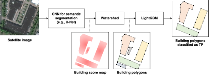
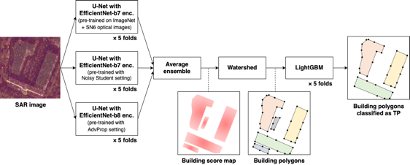

# spacenet6_solution
1.  **Introduction**

Tell us a bit about yourself, and why you have decided to participate
in the contest.

-   Name: Motoki Kimura

-   Handle: motokimura

-   Placement you achieved in the MM:

-   About you: A research engineer working on computer vision and
    machine learning. I'm especially interested in autonomous driving,
    robotics, geospatial data, and satellite images.

-   Why you participated in the MM: The uniqueness of SpaceNet6 dataset
    made me to participate this competition. I've been curious about
    how practical SAR imagery is particularly for urban analysis e.g.,
    building extraction. SpaceNet6 challenge is the first competition
    that provides large amount of high resolution SAR imagery and
    building labels so I decided to participate immediately after the
    opening announcement.

2.  **Solution Development**

How did you solve the problem? What approaches did you try and what
choices did you make, and why? Also, what alternative approaches did
you consider?
>
I started from the approach most of the winners in previous SpaceNet
challenges had taken. The pipeline of the approach consists of 3
parts:

1.  Compute building footprint score map using deep convolutional neural
    networks for semantic segmentation, e.g., U-Net.

2.  Extract building footprints as polygons from the score map using
    traditional image processing algorithms, e.g., watershed.

3.  Remove false positives (wrongly detected buildings) with LightGBM
    models which are trained on the footprint morphological features.

The figure below shows this pipeline:
>
{width="5.777777777777778in"
height="2.101882108486439in"}
>
As for the first part, I tried following to come up with the final
solution:

-   Network input and output: input to all of my segmentation networks
    is SAR image with 4 channels. The networks output score maps for 2
    classes: building body and building border. The final score map
    for building footprint, which is input to the second part of the
    pipeline, is computed as following: *score_building_body \* (1 --
    0.2 \* score_building_border)*. Learning building border helps the
    network to learn better building shapes and to separate
    neighboring buildings. This approach was often used by the winners
    in previous SpaceNet challenges so I just followed it.

-   Network architecture: I started from U-Net as it is one of the most
    popular networks in various competitions for image segmentation
    tasks including previous SpaceNet challenges, and found it the
    best for this challenge among the architectures I tried. I tried
    FPN, PSPNet, PAN, and DeepLab-v3, but none of them outperformed
    U-Net in the local validation.

-   Encoders: as for the encoder of U-Net, I tried ResNet-50/101/152,
    ResNeXt-50/101, SE-ResNeXt-50/101, SE-ResNet-50/101/152,
    SENet-154, DenseNet-161, DPN-92/131, and EfficientNet-b5/b6/b7/b8.
    EfficientNet-b7/b8 outperformed other networks with large margin
    in the local validation so I selected EfficientNet-b7/b8 as the
    encoders.

-   Encoder pre-training: pre-trained encoder helps the network to
    converge faster and often improves the accuracy. I found this was
    also the case for this challenge. I used 3 types of encoders
    pre-trained in different settings: (A) EfficientNet-b7 trained on
    ImageNet, (B) EfficientNet-b7 trained with Noisy Student setting,
    and (C) EfficientNet-b8 trained with AdvProp setting. I found
    pre-training on SpaceNet6 optical images slightly improved the
    local validation score in case of the U-Net with encoder-A. In
    contrast, no such improvement could be found in case of the U-Net
    with encoder-B/C.

-   Attention module: I used scSE module in each block of the U-Net
    decoder. It slightly improved the score both in the local
    validation and in the public leaderboard.

-   Loss function: I used simple sum of BCE loss (binary cross entropy
    loss) and dice loss. I found combining these losses helped the
    network to converge much faster and also improved the accuracy. I
    also tried focal loss instead of BCE loss, with which the network
    can put more focus on learning hard examples, but no score gain
    could be seen in the local validation.

-   Optimizer: I started from Adam optimizer and found it the best. I
    also tried AdamW which was often used by the winners of the
    previous challenges, but could not find improvement on the local
    validation score.

-   Data augmentation: I tried random flipping, rotation, brightness,
    salt and pepper noise but they just made the score worse or the
    convergence slower.

-   Input image size: although all the images have the size of 900×900
    pixels, I found that the smaller crop size mitigated overfitting
    of the model. I randomly cropped 256×256 regions and fed them to
    the network in training.

-   Aligning image orientation: all SAR images were rotated before input
    to the networks, so that the direction from which the data was
    collected is the same in every case. This moderately improved the
    score both in the local validation and in the public leaderboard.

-   Cross validation: I applied 5-fold cross validation for each U-Net
    architecture. It was crucial to separate folds by spatial location
    of the image to avoid leakage because most of the images are
    spatially overlapped. I split the dataset into 5 folds by
    longitude extracted from metadata of GeoTIFF.

-   Validation metric: IoU score of building body class was evaluated
    every epoch and was used to choose the best model of each fold.
    Computing F-score of SpaceNet building detection task takes time
    to compute so I used the IoU score for the local validation
    instead.

-   Model ensemble: as I used 3 U-Net architectures and applied 5-fold
    cross validation for each, 15 models could be ensembled to get the
    better building score map. I simply computed the average of
    outputs from 15 models. More sophisticated ensemble method may
    improve the result, but I had no time to try it.

As for the second part, I just applied watershed algorithm implemented
in scikit-image to extract building footprints as polygons from the
building score map. I also tried an alternative approach: binarize the
score map with a threshold and then extract isolated contours as
building polygons. However, this approach did not work well in the
case the buildings are densely located: neighboring buildings are
detected as one building. Watershed helped to separate such buildings.
I found that watershed with correctly tuned parameters improved the
F-score a lot (by 2-3 points) in the public leaderboard compared to
the alternative approach.
>
As for the third part, LightGBM was trained on the validation set of
each fold. The input to the LightGBM models is morphological features
of the predicted footprints. In training phase, the models learned IoU
score between the input footprint and the best matched ground-truth
building. In inference phase, by thresholding the score predicted by
LightGBM models, each footprint was classified into true positive and
false positive. The footprints classified as false positive were
removed from the final prediction in order to improve the precision
score. LightGBM models moderately improved the F-score in the public
leaderboard. As for the morphological features input to the LightGBM
models, I just used the ones found in the winners' solutions of the
previous challenges. I had no time to try, but additional input
features might further improve the result.

3.  **Final Approach**

Please provide a bulleted description of your final approach. What
ideas/decisions/features have been found to be the most important for
your solution performance:
>
The figure below summarizes my final approach:
>
{width="5.694974846894138in"
height="2.2864588801399823in"}

-   I trained U-Net whose input is SAR imagery with 4 intensity channels
    and which outputs score maps for 2 classes: building body and
    building border. The building score map is computed as following:
    *score_building_body \* (1 -- 0.2 \* score_building_border)*.

-   I used 3 U-Net architectures each of which has different pre-trained
    encoder-A, B, and C:

    -   Encoder-A: EfficientNet-b7 trained on ImageNet

    -   Encoder-B: EfficientNet-b7 trained with Noisy Student setting

    -   Encoder-C: EfficientNet-b8 trained with AdvProp setting

```{=html}
<!-- -->
```
-   I believe the choice of the encoders is one of the keys: use of
    EfficientNet-b7/b8 improved the score a lot.

-   Each U-Net has scSE attention module in decoder part.

-   I defined loss function as the sum of BCE and dice loss, and used
    Adam as the optimizer.

-   The U-Net with encoder-A was firstly trained for 140 epochs on
    pan-sharpened optical images with learning rate of 1e-4. Then it
    was fine-tuned on SAR images for 260 epochs. In this fine-tuning
    step, learning rate started from 1e-4 and was decayed by the
    factor of 0.1 at the epoch of 230.

-   The U-Net with encoder-B/C were directly trained on SAR images for
    260 epochs. The learning rate started from 1e-4 and was decayed by
    the factor of 0.1 at the epoch of 230.

-   Batch size was set to 16 for the U-Net with encoder-A/B, 14 for the
    U-Net with encoder-C. The batch size was set to the maximum that
    could be fit into a Tesla V100 GPU.

-   As for input data in training, I randomly cropped 256×256 regions
    from SAR images. The images were rotated so that the direction
    from which the data was collected was the same in every image. I
    did not use data augmentations except for the random cropping.

-   Each of 3 U-Net architectures was trained on 5 folds. IoU score of
    building body class is evaluated every epoch and is used to choose
    the best model of each fold. 3×5=15 models in total were used for
    average ensemble to get more accurate building score map.

-   Then, watershed algorithm was applied to the score map computed by
    average ensemble in order to extract building footprints as
    polygons. Watershed helped to separate neighboring buildings and
    improved the score a lot. I could not rank in top 5 without using
    watershed probably.

-   Finally, wrongly detected footprints (false positives) were removed
    with LightGBM models which were trained on the footprint
    morphological features.

-   The input morphological features include polygon area, shape
    features of smallest external rectangle, major/minor axis length,
    mean/std values of SAR intensity and predicted building score,
    neighbor candidate counts in some distance ranges, etc.

-   In training, the models learned IoU score between the input
    footprint and the best matched ground-truth building. In
    inference, the input footprint was removed from the final
    prediction if the score predicted by LightGBM is below a
    threshold.

4.  **Open Source Resources, Frameworks and Libraries**

Please specify the name of the open source resource along with a URL
to where it's housed and it's license type:

-   NVIDIA Docker,
    [[https://github.com/NVIDIA/nvidia-docker]{.ul}](https://github.com/NVIDIA/nvidia-docker),
    Apache License 2.0

-   Anaconda,
    [[https://www.anaconda.com/]{.ul}](https://www.anaconda.com/), BSD
    3-Clause License

-   PyTorch, [[https://pytorch.org/]{.ul}](https://pytorch.org/), BSD
    3-Clause License

-   segmentation_models.pytorch,
    [[https://github.com/qubvel/segmentation_models.pytorch]{.ul}](https://github.com/qubvel/segmentation_models.pytorch),
    MIT License

-   pytorch-image-models,
    [[https://github.com/rwightman/pytorch-image-models]{.ul}](https://github.com/rwightman/pytorch-image-models),
    Apache License 2.0

-   torchvision,
    [[https://github.com/pytorch/vision]{.ul}](https://github.com/pytorch/vision),
    BSD 3-Clause License

-   albumentations,
    [[https://github.com/albumentations-team/albumentations]{.ul}](https://github.com/albumentations-team/albumentations),
    MIT License

-   OpenCV, [[https://opencv.org/]{.ul}](https://opencv.org/), BSD
    3-Clause License

-   scikit-image,
    [[https://scikit-image.org/]{.ul}](https://scikit-image.org/), BSD
    3-Clause License

-   NumPy, [[https://numpy.org/]{.ul}](https://numpy.org/), BSD 3-Clause
    License

-   pandas,
    [[https://pandas.pydata.org/]{.ul}](https://pandas.pydata.org/),
    BSD 3-Clause License

-   LightGBM,
    [[https://github.com/microsoft/LightGBM]{.ul}](https://github.com/microsoft/LightGBM),
    MIT License

-   Solaris,
    [[https://github.com/CosmiQ/solaris]{.ul}](https://github.com/CosmiQ/solaris),
    Apache License 2.0

-   GeoMet,
    [[https://github.com/geomet/geomet]{.ul}](https://github.com/geomet/geomet),
    Apache License 2.0

-   Rasterio,
    [[https://github.com/mapbox/rasterio]{.ul}](https://github.com/mapbox/rasterio),
    BSD 3-Clause License

-   Shapely,
    [[https://github.com/Toblerity/Shapely]{.ul}](https://github.com/Toblerity/Shapely),
    BSD 3-Clause License

-   YACS,
    [[https://github.com/rbgirshick/yacs]{.ul}](https://github.com/rbgirshick/yacs),
    Apache License 2.0

-   tqdm,
    [[https://github.com/tqdm/tqdm]{.ul}](https://github.com/tqdm/tqdm),
    MIT License

-   tensorboard,
    [[https://www.tensorflow.org/tensorboard]{.ul}](https://www.tensorflow.org/tensorboard),
    Apache License 2.0

-   tensorboardX,
    [[https://github.com/lanpa/tensorboardX]{.ul}](https://github.com/lanpa/tensorboardX),
    MIT License

-   Jupyter, [[https://jupyter.org/]{.ul}](https://jupyter.org/), BSD
    3-Clause License

5.  **Potential Algorithm Improvements**

Please specify any potential improvements that can be made to the
algorithm:

-   Pre-training U-Net models on larger datasets in satellite image
    domain (e.g., datasets used in previous SpaceNet challenges) may
    improve the results.

-   Make use of optical images more effectively, e.g., applying domain
    adaptation techniques to the model trained on optical images so
    that it can work on SAR images etc.

6.  **Algorithm Limitations**

Please specify any potential limitations with the algorithm:

-   The algorithm does not work perfectly where the buildings are
    densely located. Some neighboring buildings tend to be detected as
    one larger building.

-   The algorithm fails to localize the buildings in some images (as
    shown in the figure below). I guess these SAR images were taken
    with a large look angle relative to the nadir and this causes the
    difficulty for the model to locate the footprints.

{width="5.139583333333333in"
height="2.689316491688539in"}


## Instructions for Final Scoring

See [INSTRUCTION.md](INSTRUCTION.md).

**Sections below are only for the model development phase.**

**Please ignore the sections below in the final testing/scoring phase.**

## Instructions for Model Development

This section provides instructions for the model development phase.

### Download SpaceNet6 data

```
# prepare data directory
DATA_DIR=${HOME}/data/spacenet6/spacenet6
mkdir -p ${DATA_DIR}
cd ${DATA_DIR}

# download and extract train data
aws s3 cp s3://spacenet-dataset/spacenet/SN6_buildings/tarballs/SN6_buildings_AOI_11_Rotterdam_train.tar.gz .
tar -xvf SN6_buildings_AOI_11_Rotterdam_train.tar.gz

# download and extract test data
aws s3 cp s3://spacenet-dataset/spacenet/SN6_buildings/tarballs/SN6_buildings_AOI_11_Rotterdam_test_public.tar.gz .
tar -xvf SN6_buildings_AOI_11_Rotterdam_test_public.tar.gz
```

### Prepare training environment

```
# git clone source
PROJ_DIR=${HOME}/spacenet6_solution
git clone git@github.com:motokimura/spacenet6_solution.git ${PROJ_DIR}

# build docker image
cd ${PROJ_DIR}
./docker/build.sh

# launch docker container
ENV=desktop  # or "mac"
./docker/run.sh ${ENV}
```

### Preprocess dataset

All commands below have to be executed inside the container.

```
./tools/compute_mean_std.py --image_subdir SAR-Intensity

./tools/compute_mean_std.py --image_subdir PS-RGBNIR

./tools/geojson_to_mask.py

./tools/split_dataset.py

./tools/separate_val_images.py

./tools/separate_val_labels.py

# optionally you can create AMI here
```

### Train segmentation models

All commands below have to be executed inside the container.

```
EXP_ID=9999  # new experiment id
./tools/train_spacenet6_model.py [--config CONFIG_FILE] EXP_ID ${EXP_ID}
```

### Test segmentation models

All commands below have to be executed inside the container.

```
EXP_ID=9999  # previous experiment id from which config and weight are loaded
./tools/test_spacenet6_model.py [--config CONFIG_FILE] --exp_id ${EXP_ID}
```

### Ensemble segmentation models

All commands below have to be executed inside the container.

```
ENSEMBLE_EXP_IDS='[9999,9998,9997,9996,9995]'  # previous experiments used for ensemble
./tools/ensemble_models.py [--config CONFIG_FILE] ENSEMBLE_EXP_IDS ${ENSEMBLE_EXP_IDS}
```

### Convert mask to polygon

All commands below have to be executed inside the container.

```
ENSEMBLE_EXP_IDS='[9999,9998,9997,9996,9995]'  # previous experiments used for ensemble
./tools/pred_array_to_poly.py [--config CONFIG_FILE] ENSEMBLE_EXP_IDS ${ENSEMBLE_EXP_IDS}
```

### Test segmentation models (val images)

All commands below have to be executed inside the container.

```
EXP_ID=9999  # previous experiment id from which config and weight are loaded
./tools/test_spacenet6_model.py --config configs/test_to_val_images.yml --exp_id ${EXP_ID}
```

### Ensemble segmentation models (val images)

All commands below have to be executed inside the container.

```
ENSEMBLE_EXP_IDS='[9999,9998,9997,9996,9995]'  # previous experiments used for ensemble
SPLIT_ID=0  # split id of the models above
TEST_IMAGE_DIR=/data/spacenet6/val_images/val_${SPLIT_ID}/SAR-Intensity
./tools/ensemble_models.py --config configs/test_to_val_images.yml ENSEMBLE_EXP_IDS ${ENSEMBLE_EXP_IDS} INPUT.TEST_IMAGE_DIR ${TEST_IMAGE_DIR}
```

### Convert mask to polygon (val images)

All commands below have to be executed inside the container.

```
ENSEMBLE_EXP_IDS='[9999,9998,9997,9996,9995]'  # previous experiments used for ensemble
./tools/pred_array_to_poly.py --config configs/test_to_val_images.yml ENSEMBLE_EXP_IDS ${ENSEMBLE_EXP_IDS}
```

### Train LGBM models

All commands below have to be executed inside the container.

```
./tools/train_lgbm.py --truth_csvs ${TRUTH_CSVS} --solution_csvs ${SOLUTION_CSVS} --imageids ${IMAGEIDS} --pred_dirs ${PRED_DIRS} --out_dir ${OUT_DIR}
```

### Test LGBM models

All commands below have to be executed inside the container.

```
./tools/test_lgbm.py --solution_csv ${SOLUTION_CSV} --imageid ${IMAGEID} --pred_dir ${PRED_DIR} --models ${MODELS} --out ${OUT} [--iou_thresh ${IOU_THRESH}]
```
